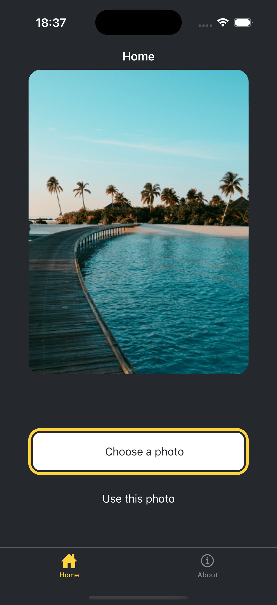
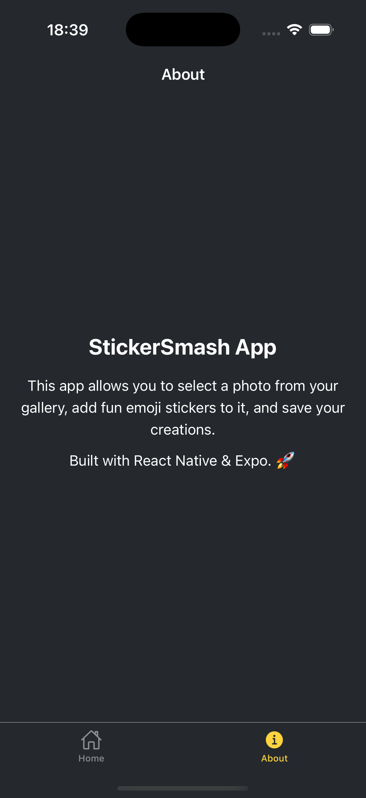
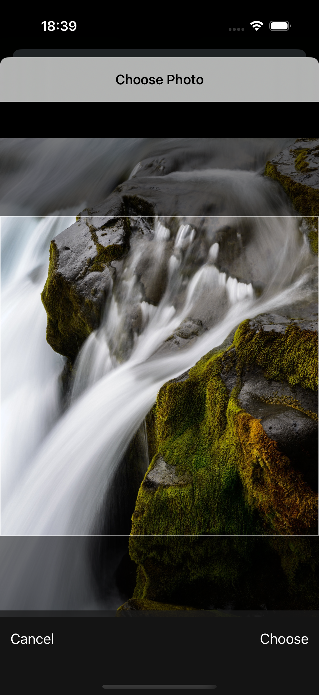
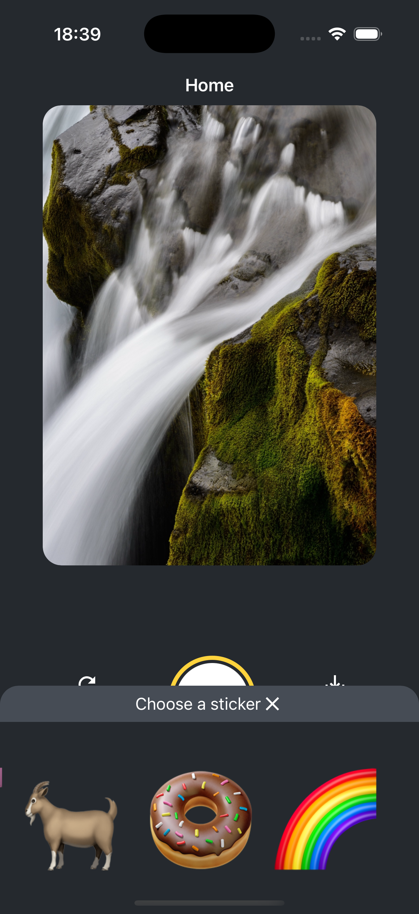
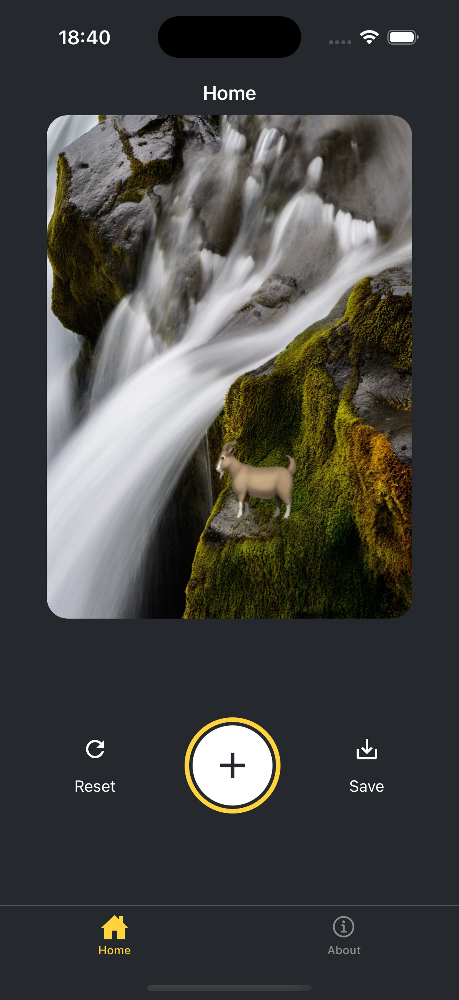
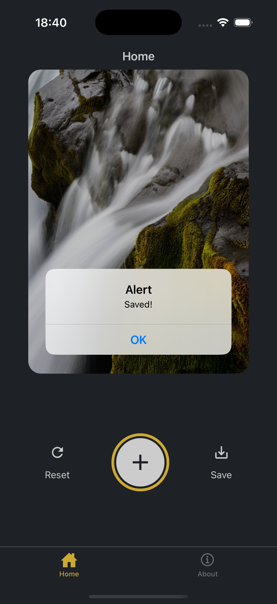

# StickerSmash

StickerSmash is a mobile application that allows you to select a photo from your gallery, add fun emoji stickers to it, and save your creations. This application is developed using React Native and Expo.

## Installation and Setup

Follow these steps to install and run the project on your local machine:

1.  **Install Dependencies:**
    ```bash
    npm install
    ```

2.  **Start the Application:**
    ```bash
    npx expo start
    ```

This command will start the application in a development environment. You can access it via an Android emulator, iOS simulator, or the Expo Go app.

## Features

* **Photo Selection:** Choose a photo from your gallery or use the default background image.
* **Add Stickers:** Add various emoji stickers to your photo.
* **Reset:** Easily undo your changes.
* **Save:** Save your edited photo to your gallery.

## Screenshots

<table>
  <tr>
    <td></td>
    <td></td>
    <td></td>
  </tr>
  <tr>
    <td></td>
    <td></td>
    <td></td>
  </tr>
</table>

## Technologies Used

The main dependencies of the project are specified in the `package.json` file:

* **Expo:** A framework and platform for developing React Native applications.
* **React & React Native:** The core libraries for building the user interface.
* **Expo Router:** Navigation management with file-based routing.
* **React Navigation:** For in-app navigation.
* **React Native Gesture Handler:** For managing touches and gestures.
* **React Native Reanimated:** for creating advanced animations.
* **React Native ViewShot:** For taking snapshots of components.

## Project Structure

The main directory structure of the project is as follows:

* **app/**: Contains the screens and navigation logic of the application.
    * **(tabs)/**: Houses the screens accessed via the bottom tab bar.
* **assets/**: Contains static assets like images and icons.
* **components/**: Contains reusable components used throughout the application.
* **scripts/**: Contains helper scripts like project reset.

## License

This is a private project and does not have a license.
